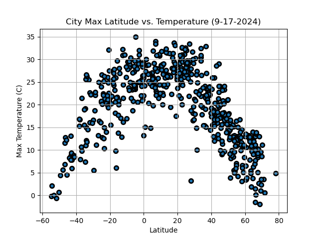

# PYTHON-API

## Website: 
[website](https://github.com/Rock-Roll1968/python-api-challenge)

## Description
Ideal Weather for Vacation Analysis

## Table of Contents
- [Installation](#installation)
- [Usage](#usage)
- [Credits](#credits)
- [License](#license)
- [Features](#features)

- [Contact](#contact)

## Installation
Python, API Key, Jupyter Notebook, CSV, Pandas

## Usage
Run the ipynb file

## Credits
Ernesto Garcia

## License
MIT

## Features
Provides ideal weather scatter plots and map with hover pop-up with nearest hotel name.

## Contact
If there are any questions or concerns, I can be reached at:
##### [github: Rock-Roll1968](https://github.com/Rock-Roll1968)
##### [email: ernesto.v.garcia@outlook.com](mailto:ernesto.v.garcia@outlook.com)
